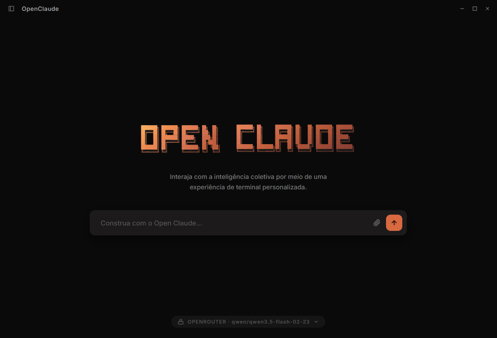
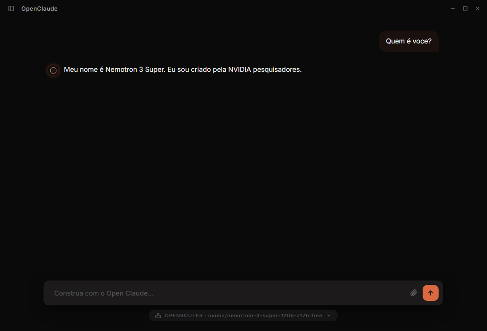
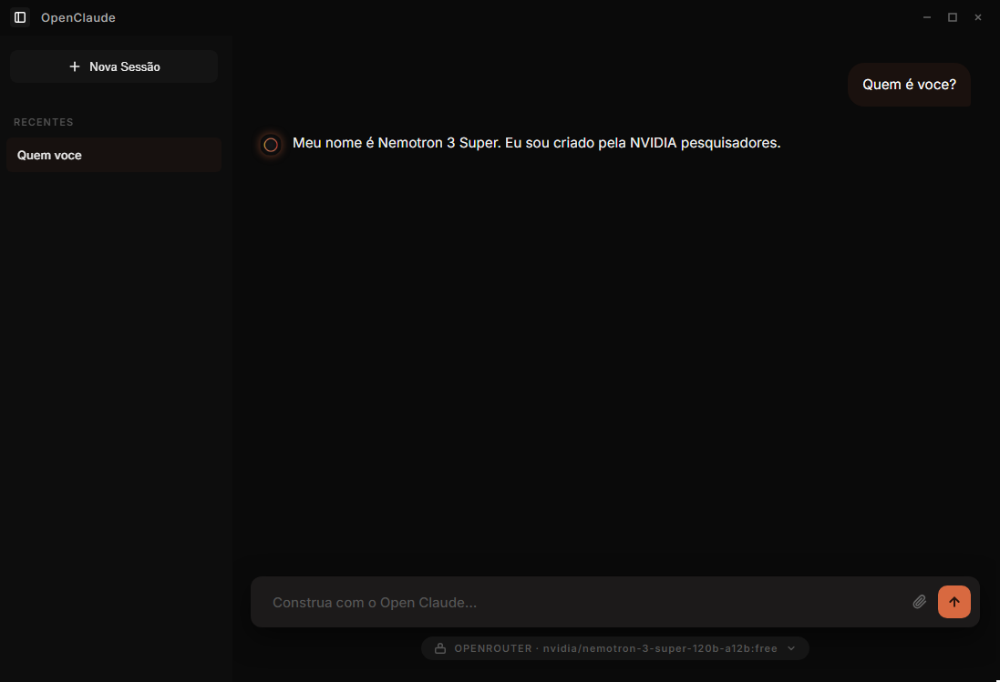
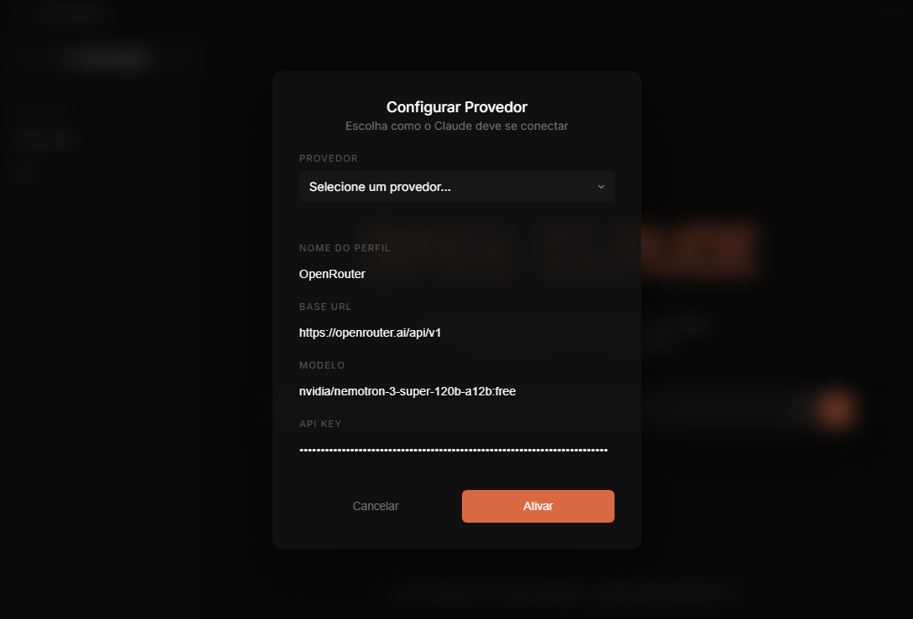

# 🚀 OpenClaude GUI

<div align="center">
  
  
  <p align="center">
    <strong>Uma interface desktop moderna, rápida e elegante para o OpenClaude.</strong>
  </p>

  <p align="center">
    
    
    
    
  </p>
</div>

---

## 🌟 O que é o OpenClaude GUI?

O **OpenClaude GUI** é o cliente desktop oficial para o projeto **OpenClaude**. Criado e mantido por **Danilo Oliveira**, este projeto foi desenvolvido para proporcionar uma experiência de usuário premium, focada em produtividade e uma estética moderna.

Nascido da necessidade de ter uma interface local poderosa e fácil de usar, ele conecta você diretamente ao poder do OpenClaude sem as distrações do navegador.

## ✨ Funcionalidades Principais

- 🖥️ **Interface Nativa**: Construído com **Tauri 2**, garantindo baixo consumo de recursos e performance máxima.
- 🎨 **Design Premium**: Estética *glassmorphism* com bordas finas e sombras suaves para um visual state-of-the-art.
<br><br>

<br><br>

- 💬 **Gestão de Sessões**: Histórico de chat persistente e organizado para que você nunca perca o fio da meada.
<br><br>

<br><br>

- 🤖 **Seletor de Modelos**: Troque entre diferentes versões e provedores do OpenClaude com facilidade através de uma interface intuitiva.
- 🚀 **Performance**: Frontend ultra-rápido utilizando **Vite** e Vanilla JS/CSS.
- 📂 **Multi-provedores**: Suporte a Anthropic, OpenAI, OpenRouter e outros via configuração flexível.

## 🛠️ Tecnologias Utilizadas

- [Tauri 2](https://tauri.app/) - Backend em Rust, UI em Webview.
- [Vite](https://vitejs.dev/) - Tooling de frontend rápido.
- [Vanilla CSS/JS](https://developer.mozilla.org/en-US/) - Para controle total e performance.

## 🚀 Como Começar

### Configuração Inicial
Após instalar, o primeiro passo é configurar seu provedor de IA (como OpenRouter ou Anthropic) para que o OpenClaude possa se conectar aos modelos:

<br>

<br><br>

### Pré-requisitos
Antes de começar, você precisará ter instalado:
- [Node.js](https://nodejs.org/)
- [Rust](https://www.rust-lang.org/tools/install) (necessário para o Tauri)

### Instalação

1. Clone o repositório:
   ```bash
   git clone https://github.com/Danilitoxp/openclaude-gui.git
   cd openclaude-gui
   ```

2. Instale as dependências:
   ```bash
   npm install
   ```

3. Inicie em modo de desenvolvimento:
   ```bash
   npm run tauri:dev
   ```

### Build

Para gerar o executável final:
```bash
npm run tauri:build
```

## 🤝 Contribuindo

Este projeto foi idealizado por **Danilo Oliveira** e é aberto para que a comunidade possa contribuir, evoluir e tornar o OpenClaude a melhor alternativa open source! Sinta-se à vontade para abrir issues ou enviar Pull Requests.

1. Faça um Fork do projeto
2. Crie sua Feature Branch (`git checkout -b feature/NovaFeature`)
3. Commit suas mudanças (`git commit -m 'Add: Nova Feature'`)
4. Push para a Branch (`git push origin feature/NovaFeature`)
5. Abra um Pull Request

---

<div align="center">
  <p>Criado por <strong>Danilo Oliveira</strong>.</p>
  <p>Desenvolvido com ❤️ para a comunidade Open Source.</p>
</div>
